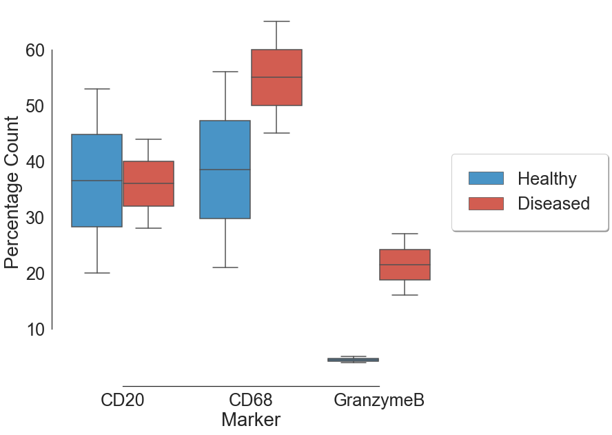

This folder contains the scripts and data to reproduce the result in the paper "Spatially visualized single-cell pathology of highly multiplexed protein profiles in health and disease"

From IMC image dataset, we can look at Immune cell expression in health and disease 

The expression level for all the markers across health and disease can be summarized as follow:

Then, pixel level clustering with KMeans is performed to extract the anatomical properties.

The clustered images are then combined together in one image in order to visualize the clusters representation

In order to better understand the spatial anatomy in various dataset, intra and inter cluster distance network is generated

It is also possible to look at individual markers by generating spatial reference map with fixed node 

It is possible to look at the 2D and 3D topographic layer of specific markers such as CD44, Pankeratin and GranzymeB

# Organization

## Data
"data" folder contains all the necessary data to reproduce the results in the paper:
- "raw" folder contains all the gray scale image of IMC for each Region of Interest (ROI) for each marker
- "masks" folder contains all the binary mask from IMC images defined by thresholds 
- "cell_masks" folder contains all the single cell segmentation for each ROI
- "clusters" folder contains the anatomical clustering of each ROI 

## Notebooks 
"notebooks" folder contains jupyter notebook script used:
- 01_image_level_clustering is the script for performing KMeans clustering of marker images
- 02_cluster_representation is the script for generating combined image of mean cluster images
- 03_marker_stats is the script for generating statistical plot of combination of ROI such as area and expression level 
- 04_spatial_proximity_plot is the script for plotting spatial proximity for pair of markers from a ROI
- 05_topographic_map is the script for generating 3D visualization of markers from a ROI
- 06_stats_plot is the script for generating statistical plot for individual ROI 
- 07_network_viz is the script for generating network visualization of intra and inter cluster spatial map using NetworkX package 
- 08_spatial_reference_map is the script for generating network visualization of spatial reference map using NetworkX package 

## Source code
"src" folder contains customs scripts used:
- "my_io.py" is the custom python scripts used for reading images and their info
- "pipeline_analyis_cellseg.cpproj" is used for cell profiler for single cell segmentation 

## Figures 
"figures" folder contains generated figures for the paper

